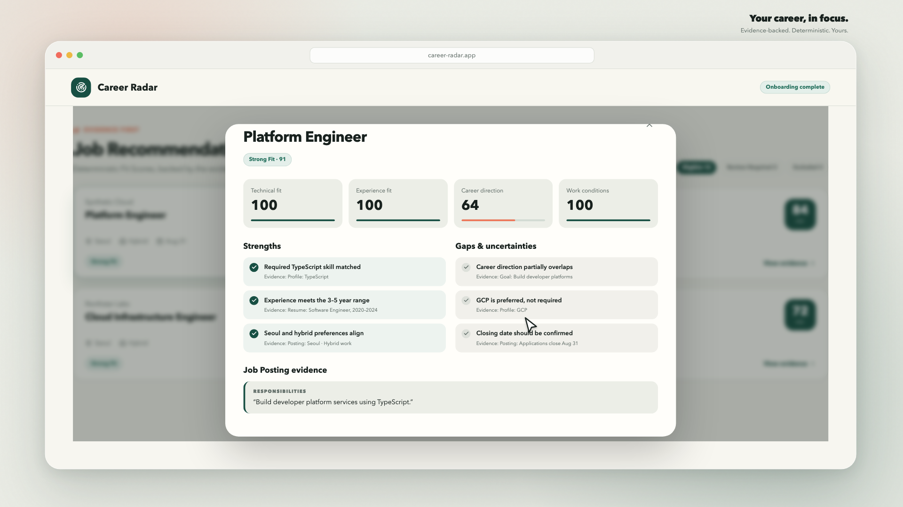

<h1 align="center">Career Radar</h1>

<p align="center">
  <strong>Your career, in focus.</strong><br>
  Evidence-backed Job Recommendations, ranked deterministically around you.
</p>

<p align="center">
  
  
  
  
  
</p>

<p align="center">
  <a href="#product-demo">Watch the demo</a>
  ·
  <a href="#quick-start">Run locally</a>
  ·
  <a href="docs/PRD.md">Product docs</a>
  ·
  <a href="https://github.com/jhojin7/career-radar/issues/1">Canonical spec</a>
</p>

## Product demo

<p align="center">
  <a href="https://youtu.be/uxYmZnxHE5g">
    
  </a>
</p>

<p align="center">
  <a href="https://youtu.be/uxYmZnxHE5g"><strong>▶ Watch on YouTube</strong></a>
  <br>
  <sub>15-second product demo · H.264 · 1080p</sub>
</p>

## Why Career Radar

Most job discovery tools tell you *what* matched. Career Radar also tells you *why*.
It turns a confirmed Candidate Profile and a collected Job Pool into reproducible Job
Recommendations, with the evidence, strengths, gaps, and Disqualifying Conditions
behind every Fit Score.

| Your profile | Your Job Pool | Your recommendations |
| --- | --- | --- |
| Extract a Profile Draft from a PDF resume, then confirm the facts and preferences that matter. | Collect TXT/PDF Job Postings on demand or on a schedule, with revision-aware deduplication. | Rank by four explainable fit components, surface ambiguity as Review Required, and keep exclusions evidence-gated. |

### How it works

1. Upload a PDF resume and review the extracted Profile Draft.
2. Confirm the Candidate Profile and three to five Search Targets.
3. Collect and normalize Job Postings into the Job Pool.
4. Evaluate evidence, Disqualifying Conditions, and four fit components.
5. Explore ranked Job Recommendations and preview custom Fit Weights.

> **Current scope:** a responsive React/Vite interface, Hono HTTP Interface,
> Vertex AI Gemini extraction, immutable Candidate Profile versions in Firestore,
> local or Cloud Storage blobs, manual and scheduled Collection Runs, and
> deterministic recommendation ranking.

## Quick start

### Prerequisites

- Node.js 22 or newer
- pnpm 10
- Google Cloud CLI with a project that has Vertex AI enabled
- A local Firestore emulator

### Local development

Authenticate Application Default Credentials once and start the Firestore emulator in a separate terminal:

```bash
gcloud auth application-default login
gcloud emulators firestore start --host-port=127.0.0.1:8080
```

Then install and run Career Radar. `GOOGLE_CLOUD_PROJECT` is the real Vertex AI project; the separate emulator project ID keeps local structured data isolated.

```bash
pnpm install
FIRESTORE_EMULATOR_HOST=127.0.0.1:8080 \
FIRESTORE_PROJECT_ID=career-radar-local \
GOOGLE_CLOUD_PROJECT=your-gcp-project \
pnpm dev
```

Open <http://localhost:5173>. Vite serves the browser UI and proxies `/api` requests to Hono on port 3000.

Optional configuration:

- `GOOGLE_CLOUD_LOCATION` defaults to `global`.
- `GEMINI_MODEL` defaults to `gemini-2.5-flash`.
- Resume PDFs are written under ignored `data/resumes/` local blob storage.
- Set `RESUME_BUCKET` in a deployed environment to store resume PDFs in Cloud Storage. Production and Cloud Run startup fail fast when it is missing.

## Job Pool collection

Place a prepared corpus under the ignored `data/job-postings/` directory. Each `.txt` or `.pdf` file must contain exactly one Job Posting. Other file types are ignored. To attach a stable source identity or preserve an original URL, add an optional `manifest.json` beside the files:

```json
{
  "postings": {
    "platform-engineer.txt": {
      "sourceAdapter": "manual-export",
      "sourceIdentity": "posting-123",
      "originalUrl": "https://example.com/jobs/123"
    }
  }
}
```

After onboarding, the Job Pool panel can also import up to 50 TXT/PDF files at once. Browser imports are staged under ignored `data/job-imports/` locally or the `job-imports/` prefix of `JOB_SOURCE_BUCKET` in production, then consumed by the same Collection Run worker as the configured corpus. A failed posting can be retried from the Failed recommendations view; that retry creates a Collection Run scoped to only the selected source key.

After confirming a Candidate Profile and three to five Search Targets, run the terminating worker against the Firestore emulator and Vertex AI:

```bash
FIRESTORE_EMULATOR_HOST=127.0.0.1:8080 \
FIRESTORE_PROJECT_ID=career-radar-local \
GOOGLE_CLOUD_PROJECT=your-gcp-project \
pnpm collect
```

Set `JOB_CORPUS_DIR` to use another directory. Raw Job Posting inputs are copied to ignored `data/job-sources/` storage while normalized fields are stored in Firestore. In a deployed environment, set `JOB_SOURCE_BUCKET` (or reuse `RESUME_BUCKET`) for Cloud Storage. The tracked `fixtures/job-postings/` corpus is synthetic and can be selected with `JOB_CORPUS_DIR=fixtures/job-postings`.

### Optional LinkedIn source

LinkedIn collection is disabled by default. Set `LINKEDIN_COLLECTION_ENABLED=true` to add a best-effort public LinkedIn source to the same Collection Run as the local corpus:

```bash
LINKEDIN_COLLECTION_ENABLED=true \
LINKEDIN_MAX_RESULTS=5 \
LINKEDIN_MAX_QUERIES=3 \
LINKEDIN_RECENCY_DAYS=7 \
pnpm collect
```

Each query combines a confirmed Search Target's role, location, and work modes with the configured recency window. Requests are sequential and stop conservatively when LinkedIn rate-limits them. `LINKEDIN_MAX_RESULTS` accepts 1–10 (default 10); `LINKEDIN_MAX_QUERIES` accepts 1–5 (default 5); `LINKEDIN_RECENCY_DAYS` defaults to 7 and is capped at 30. The optional `LINKEDIN_REQUEST_DELAY_MS` (default 1000, minimum 500) and `LINKEDIN_REQUEST_TIMEOUT_MS` (default 10000) tune request pacing and timeouts.

The adapter uses only public, unauthenticated Job Posting pages. LinkedIn markup and availability can change without notice, so this source is intended only for personal, low-volume collection. A LinkedIn error appears in Collection Run diagnostics while local-source results continue through the existing normalization, deduplication, revision, and persistence path. See [the manual verification guide](docs/manual-verification/linkedin-collection.md).

## Production build, local adapters

```bash
pnpm build
pnpm start
```

Open <http://localhost:3000>. Hono serves the compiled React application and the health operation at `/api/healthz`. Unless `APP_ENV=production` is set, this still uses the Firestore emulator/local blob configuration and does not require a password.

## Deploy to Cloud Run

The checked-in `Dockerfile` builds the React assets and TypeScript server into one Node.js 22 image. Its default entrypoint serves both Hono and the compiled React application on `PORT`; the Cloud Run Job uses the separate terminating worker entrypoint `node dist/server/worker.js` without duplicating collection logic.

Before the first deployment, choose a Google Cloud project and create two Secret Manager secrets. Add secret versions without placing either value in a command argument or tracked file:

```bash
gcloud secrets create career-radar-shared-password --replication-policy=automatic --project "$PROJECT_ID"
read -rs SHARED_PASSWORD_VALUE
printf %s "$SHARED_PASSWORD_VALUE" | gcloud secrets versions add career-radar-shared-password --data-file=- --project "$PROJECT_ID"
unset SHARED_PASSWORD_VALUE

gcloud secrets create career-radar-cookie-signing-secret --replication-policy=automatic --project "$PROJECT_ID"
openssl rand -base64 48 | gcloud secrets versions add career-radar-cookie-signing-secret --data-file=- --project "$PROJECT_ID"
```

Deploy from a clean checkout with the required inputs. The script enables the required APIs, creates or reuses a Firestore Native Mode database, regional Artifact Registry repository, uniform-access Cloud Storage bucket, and dedicated Cloud Run service account, then builds and deploys the image.

```bash
PROJECT_ID=your-gcp-project \
REGION=asia-northeast3 \
RESUME_BUCKET=your-globally-unique-career-radar-sources \
SHARED_PASSWORD_SECRET=career-radar-shared-password \
COOKIE_SIGNING_SECRET=career-radar-cookie-signing-secret \
bash scripts/deploy-cloud-run.sh
```

The script deploys a web service, a single-task Collection Job, and an authenticated Cloud Scheduler HTTP trigger. Set `COLLECTION_SCHEDULE` (default `0 */6 * * *`) and `COLLECTION_TIME_ZONE` (default `Asia/Seoul`) to configure the schedule. The web and scheduler identities receive `roles/run.invoker` only on the Job. The web and Job identities receive the Firestore, Vertex AI, and bucket permissions they require; only the web identity can read the two named secrets. Cloud Run itself allows unauthenticated service invocation so the login page is reachable; all application operations are protected by the shared-password session.

Deployment fails before the server starts if required production configuration is missing, if the Firestore emulator is accidentally configured, or if the cookie-signing secret is shorter than 32 characters. Configuration is injected with these environment variables:

- `GOOGLE_CLOUD_PROJECT`, `GOOGLE_CLOUD_LOCATION`, and `GEMINI_MODEL`
- `CLOUD_RUN_JOB_NAME` and `CLOUD_RUN_JOB_LOCATION` on the web service
- `PROFILE_PROMPT_VERSION`, `SEARCH_TARGET_PROMPT_VERSION`, and `JOB_POSTING_PROMPT_VERSION`
- `RESUME_BUCKET` and `JOB_SOURCE_BUCKET`
- `SHARED_PASSWORD` and `COOKIE_SIGNING_SECRET` through Secret Manager references
- `SESSION_TTL_SECONDS` (optional, default 12 hours)

The deployment uses the synthetic fixture corpus by default so the current Collection Run workflow remains demonstrable. Override `JOB_CORPUS_DIR` when the image contains a different prepared corpus. Follow the [scheduled Collection Run verification](docs/manual-verification/scheduled-collection.md) after deployment. No live Google Cloud integration test is part of CI.

## Verification

```bash
pnpm lint
pnpm typecheck
pnpm test
pnpm build
```

## Application shape

```text
Browser
  └── React + Vite + shadcn/ui
        └── Hono HTTP Interface
              ├── Deterministic Recommendation Module
              ├── Vertex AI Profile Extraction Adapter (Google Gen AI SDK + ADC)
              ├── Local TXT/PDF + optional public LinkedIn Job Sources
              ├── Vertex AI Job Posting Extraction Adapter
              ├── Firestore Onboarding Persistence Adapter
              ├── Firestore Collection Persistence Adapter
              └── Local or Cloud Resume and Job Source Blob Storage Adapters
```

The Hono application is constructed with injected Adapters so automated tests exercise onboarding, import, deduplication, revision, counters, partial failure, and recommendation list/detail behavior without calling Vertex AI or Firestore. The recommendation Module also has table-driven coverage for scoring, exclusions, ambiguity, verdict boundaries, custom weights, ordering, and repeatability.
