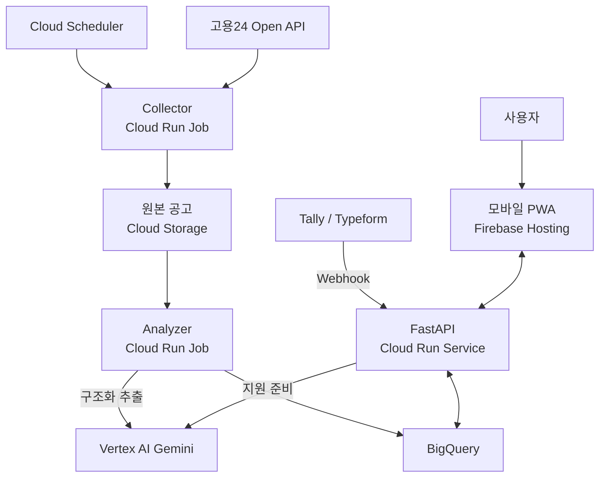
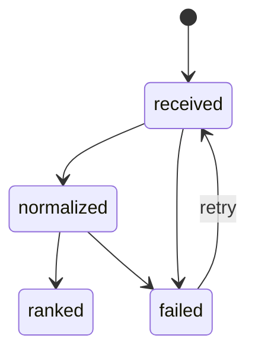
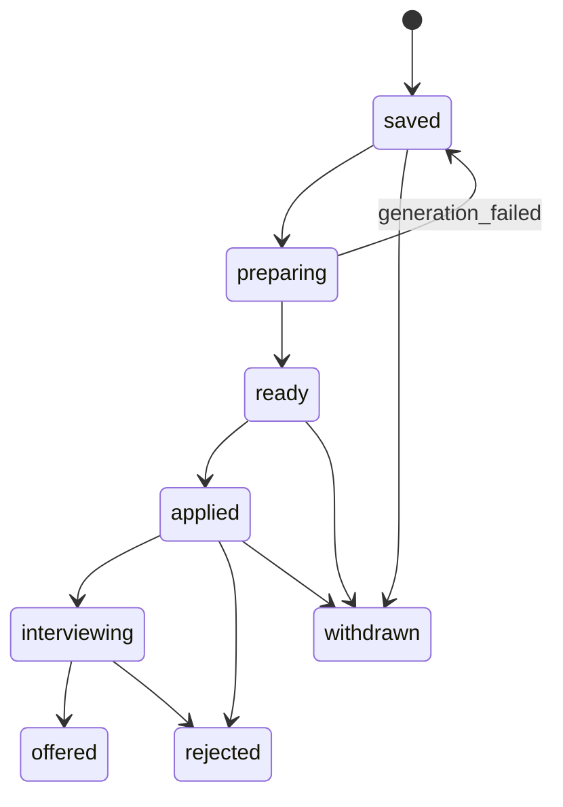

# Career Radar — Technical Specification

| 항목 | 내용 |
|---|---|
| 상태 | Draft |
| 버전 | 0.1 |
| 작성일 | 2026-07-23 |
| 목표 데모 | 2026-07-31 |
| 기준 문서 | `PRD.md` v0.1 |

## 1. 범위

본 문서는 Career Radar MVP의 GCP 구성, 서비스 경계, 데이터 계약, API, 평가 규칙, 배포와 테스트 기준을 정의함.

MVP의 `Scrape`, `Rank`, `Apply`는 다음 의미로 사용함.

- **Scrape:** 고용24 Open API 수집과 사용자의 공고 본문 직접 입력
- **Rank:** Gemini 구조화 추출 후 Python 규칙 기반 필터와 점수 계산
- **Apply:** 실제 제출이 아닌, 선택 공고의 지원 준비 브리프 생성

## 2. 시스템 아키텍처



### 2.1 처리 경로

- **온라인 경로:** 모바일 PWA → FastAPI → BigQuery 또는 Vertex AI
- **배치 경로:** Cloud Scheduler → Collector Job → Cloud Storage → Analyzer Job → BigQuery
- **외부 입력:** 폼 Webhook과 고용24 Open API

초기 규모에서는 Pub/Sub, Dataflow, Cloud SQL을 사용하지 않음. 컴포넌트 수를 줄이고 짧은 PBL 일정 내에 배치 재실행과 추적 가능성을 확보하는 선택임.

## 3. 기술 스택

| 영역 | 선택 | 책임 |
|---|---|---|
| 프론트엔드 | React, TypeScript, MUI, PWA | 모바일 피드, 상세, 스킬 갭, 지원 현황 |
| 정적 호스팅 | Firebase Hosting | 프론트엔드 배포와 SPA 라우팅 |
| API | Python 3.12, FastAPI, Pydantic | Webhook, 조회, 직접 입력, 지원 준비, 상태 기록 |
| 실행 환경 | Cloud Run Service / Cloud Run Jobs | 온라인 API와 배치 작업 분리 |
| 스케줄 | Cloud Scheduler | 일일 수집 Job 실행 |
| 생성형 AI | Vertex AI Gemini | 구조화 추출과 지원자료 생성 |
| 원본 저장 | Cloud Storage | 변경되지 않는 API 응답과 공고 본문 보관 |
| 분석 저장 | BigQuery | 프로필, 공고, 평가, 이벤트, 실행 기록 |
| 비밀 관리 | Secret Manager | API 키와 Webhook 비밀값 |
| 관측 | Cloud Logging, Cloud Monitoring | 구조화 로그, 오류율, 실행 상태 |

## 4. 주요 설계 결정

| 결정 | 근거 |
|---|---|
| 원형 저장소를 그대로 배포하지 않고 개념만 적용함 | 원형은 로컬 에이전트 워크플로이며 멀티 사용자 웹 서비스 구조가 아님 |
| Gemini와 점수 엔진을 분리함 | 비정형 추출은 LLM에 적합하고 필터·점수는 결정론이 필요함 |
| 원본과 정규화 데이터를 분리함 | 재처리, 오류 조사, 프롬프트 버전 비교가 쉬워짐 |
| BigQuery를 MVP 시스템 오브 레코드로 사용함 | 분석과 집계를 한 저장소에서 처리하고 운영 컴포넌트를 줄임 |
| 지원 상태를 append-only 이벤트로 기록함 | BigQuery에서 빈번한 행 수정을 피하고 변경 이력을 보존함 |
| 지원 준비를 온디맨드로 실행함 | 비용과 지연을 선택 공고에만 사용함 |
| 자동 지원을 제외함 | 외부 사이트 약관, 인증, 오류 제출 위험을 피함 |

## 5. 저장소 구조

```text
career-radar/
├── frontend/
│   ├── src/
│   │   ├── api/
│   │   ├── components/
│   │   ├── pages/
│   │   └── types/
│   ├── firebase.json
│   └── package.json
├── backend/
│   ├── app/
│   │   ├── api/
│   │   ├── core/
│   │   ├── models/
│   │   ├── repositories/
│   │   └── services/
│   ├── jobs/
│   │   ├── collector/
│   │   └── analyzer/
│   ├── tests/
│   ├── Dockerfile
│   └── pyproject.toml
├── infra/
│   ├── terraform/
│   └── bigquery/
├── fixtures/
│   └── job_postings/
├── PRD.md
└── SPEC.md
```

## 6. 도메인 모델

### 6.1 CandidateProfile

```json
{
  "profile_id": "prof_01J...",
  "version": 1,
  "target_roles": [
    "python_backend",
    "ai_data",
    "agent_workflow_tooling"
  ],
  "experience_years": 2,
  "skills": [
    {"name": "Python", "level": "advanced"},
    {"name": "FastAPI", "level": "intermediate"},
    {"name": "GCP", "level": "intermediate"}
  ],
  "preferred_locations": ["서울", "송파구", "강남구"],
  "preferred_work_modes": ["hybrid", "remote"],
  "allow_overseas_remote": true,
  "excluded_employment_types": ["contract", "dispatch", "outsourced_onsite"],
  "max_required_experience_years": 4,
  "created_at": "2026-07-23T10:00:00Z"
}
```

규칙:

- `profile_id`는 논리적 사용자 프로필을 식별함.
- 수정 시 기존 행을 덮어쓰지 않고 `version`을 증가시킴.
- 공개 데모에서는 실제 이력서 전문과 연락처를 저장하지 않음.

### 6.2 JobRecord

```json
{
  "job_id": "job_01J...",
  "revision": 1,
  "source": "work24",
  "source_job_id": "K123...",
  "source_url": "https://...",
  "title": "Python Backend Engineer",
  "company_name": "Example",
  "description_text": "...",
  "employment_types": ["full_time"],
  "locations": ["서울 강남구"],
  "work_modes": ["hybrid"],
  "experience": {
    "min_years": 1,
    "max_years": 3,
    "raw_text": "경력 1~3년"
  },
  "required_skills": ["Python", "FastAPI", "SQL"],
  "preferred_skills": ["GCP", "LLM"],
  "responsibilities": ["API 개발", "AI workflow 운영"],
  "closing_at": "2026-08-10T14:59:59Z",
  "content_sha256": "hex...",
  "processing_state": "normalized",
  "ingested_at": "2026-07-23T11:00:00Z"
}
```

### 6.3 JobEvaluation

```json
{
  "evaluation_id": "eval_01J...",
  "job_id": "job_01J...",
  "job_revision": 1,
  "profile_id": "prof_01J...",
  "profile_version": 1,
  "excluded": false,
  "exclusion_codes": [],
  "review_required": false,
  "scores": {
    "technical": 80,
    "experience": 100,
    "career_alignment": 90,
    "work_preference": 80,
    "overall": 87
  },
  "verdict": "strong_fit",
  "matched_skills": ["Python", "FastAPI", "GCP"],
  "missing_skills": ["Kubernetes"],
  "evidence": [
    {
      "field": "experience.min_years",
      "quote": "경력 1~3년"
    }
  ],
  "model_id": "configured-at-deploy",
  "prompt_version": "extract-v1",
  "scoring_version": "score-v1",
  "created_at": "2026-07-23T11:02:00Z"
}
```

### 6.4 ApplicationEvent

```json
{
  "event_id": "evt_01J...",
  "profile_id": "prof_01J...",
  "job_id": "job_01J...",
  "from_state": "ready",
  "to_state": "applied",
  "note": "회사 채용 페이지에서 직접 지원",
  "created_at": "2026-07-23T12:00:00Z"
}
```

### 6.5 ApplicationBrief

```json
{
  "brief_id": "brief_01J...",
  "profile_id": "prof_01J...",
  "profile_version": 1,
  "job_id": "job_01J...",
  "job_revision": 1,
  "requirements_summary": ["..."],
  "experience_to_emphasize": ["..."],
  "gaps_and_questions": ["..."],
  "cover_letter_outline": ["..."],
  "interview_questions": ["..."],
  "model_id": "configured-at-deploy",
  "prompt_version": "brief-v1",
  "created_at": "2026-07-23T12:00:00Z"
}
```

## 7. BigQuery 설계

데이터셋 이름은 환경별로 `career_radar_dev`, `career_radar_prod`를 사용함.

| 테이블 | 주요 키 | 파티션 | 클러스터 | 설명 |
|---|---|---|---|---|
| `profiles` | `profile_id`, `version` | `DATE(created_at)` | `profile_id` | 프로필 버전 |
| `jobs` | `job_id`, `revision` | `DATE(ingested_at)` | `source`, `company_name` | 정규화된 공고 리비전 |
| `evaluations` | `evaluation_id` | `DATE(created_at)` | `profile_id`, `verdict` | 프로필별 공고 평가 |
| `application_briefs` | `brief_id` | `DATE(created_at)` | `profile_id`, `job_id` | 생성된 지원 준비 자료 |
| `application_events` | `event_id` | `DATE(created_at)` | `profile_id`, `job_id` | append-only 상태 변경 |
| `pipeline_runs` | `run_id` | `DATE(started_at)` | `pipeline_name`, `status` | 배치 실행과 오류 요약 |

최신 상태와 최신 리비전은 View로 제공함.

- `latest_profiles`
- `latest_jobs`
- `latest_evaluations`
- `latest_application_states`
- `ranked_job_feed`

## 8. Cloud Storage 설계

버킷은 비공개로 유지하고 Uniform bucket-level access를 사용함.

```text
gs://{project}-career-radar-raw/
├── jobs/
│   ├── work24/{yyyy}/{mm}/{dd}/{content_sha256}.json
│   └── manual/{yyyy}/{mm}/{dd}/{content_sha256}.json
└── failed/
    └── {pipeline}/{yyyy}/{mm}/{dd}/{run_id}/{job_id}.json
```

원본 객체 메타데이터에 `source`, `source_job_id`, `ingested_at`, `run_id`를 기록함. 민감한 폼 응답 전문은 원본 버킷에 저장하지 않음.

## 9. API 명세

기본 경로는 `/api`이며 JSON만 사용함.

| Method | Path | 용도 | 성공 응답 |
|---|---|---|---|
| `GET` | `/healthz` | 서비스 상태 확인 | `200` |
| `POST` | `/webhooks/tally` | 프로필 생성 또는 새 버전 저장 | `202` |
| `POST` | `/v1/jobs/import` | 공고 본문 직접 추가 | `202` |
| `GET` | `/v1/jobs` | 정렬·필터된 공고 피드 | `200` |
| `GET` | `/v1/jobs/{job_id}` | 공고와 최신 평가 상세 | `200` |
| `POST` | `/v1/jobs/{job_id}/prepare` | 지원 준비 생성 요청 | `202` |
| `GET` | `/v1/jobs/{job_id}/brief` | 최신 지원 준비 조회 | `200` |
| `PATCH` | `/v1/jobs/{job_id}/status` | 지원 상태 이벤트 추가 | `201` |
| `GET` | `/v1/insights/skill-gaps` | 부족 기술 집계 | `200` |
| `GET` | `/v1/pipeline-runs/latest` | 최근 배치 실행 상태 | `200` |

Cloud Run Job 진입점은 공개 HTTP API로 제공하지 않음. Cloud Scheduler는 인증된 Google API 호출로 Job을 실행함.

### 9.1 `POST /v1/jobs/import`

요청:

```json
{
  "source_url": "https://example.com/jobs/123",
  "title_hint": "Backend Engineer",
  "description_text": "채용공고 본문..."
}
```

응답:

```json
{
  "job_id": "job_01J...",
  "processing_state": "received",
  "duplicate": false
}
```

제약:

- `description_text`는 200~100,000자임.
- HTML 입력은 텍스트로 정제함.
- 동일 본문 해시가 있으면 기존 `job_id`를 반환함.

### 9.2 `GET /v1/jobs`

쿼리:

- `status`: 지원 상태
- `verdict`: 적합도 판정
- `include_excluded`: 기본값 `false`
- `sort`: `fit_score`, `closing_at`, `ingested_at`
- `cursor`: 페이지 커서
- `limit`: 기본 20, 최대 50

### 9.3 `POST /v1/jobs/{job_id}/prepare`

- 같은 `profile_version`, `job_revision`, `prompt_version` 조합의 결과가 있으면 재사용함.
- 실행 중이면 `202`와 기존 작업 ID를 반환함.
- 실제 지원 제출이나 외부 사이트 변경을 수행하지 않음.

### 9.4 오류 형식

```json
{
  "error": {
    "code": "JOB_NOT_FOUND",
    "message": "요청한 공고를 찾을 수 없음",
    "request_id": "req_01J..."
  }
}
```

## 10. 상태 모델

### 10.1 공고 처리



### 10.2 지원 진행



상태 전이는 API에서 검증함. 모든 전이는 `application_events`에 새 행으로 기록함.

## 11. 처리 워크플로

### 11.1 프로필 Webhook

1. Webhook 비밀값 또는 서명을 검증함.
2. 공급자 필드를 내부 `CandidateProfile`로 매핑함.
3. Pydantic 검증을 수행함.
4. 프로필의 다음 버전을 BigQuery에 추가함.
5. `202 Accepted`를 반환함.

### 11.2 예약 수집

1. Cloud Scheduler가 매일 Collector Job을 실행함.
2. Collector가 `run_id`를 생성하고 `pipeline_runs`에 시작 행을 기록함.
3. 고용24 API를 페이지 단위로 조회함.
4. 응답 원본을 Cloud Storage에 저장함.
5. `source_job_id`, 정규화 URL, 본문 해시로 중복을 판별함.
6. 신규 또는 변경 공고를 `jobs`에 추가함.
7. Analyzer Job이 처리할 대상 목록을 생성함.
8. 성공·실패·건너뜀 수를 `pipeline_runs`에 기록함.

Collector와 Analyzer는 같은 Cloud Run Job의 서로 다른 command로 시작할 수 있음. MVP 일정상 별도 이미지가 필요하지 않음.

### 11.3 분석과 순위 계산

1. 처리 대상 원문을 Cloud Storage에서 읽음.
2. Gemini에 구조화 추출을 요청함.
3. Pydantic으로 응답 스키마와 근거 문구를 검증함.
4. 결정론적 hard filter를 적용함.
5. 통과 공고의 하위 점수와 전체 점수를 계산함.
6. 결과와 모델·프롬프트·점수 버전을 `evaluations`에 저장함.
7. 공고 처리 상태를 `ranked` 또는 `failed`로 기록함.

### 11.4 지원 준비

1. API가 최신 프로필과 요청 공고 리비전을 조회함.
2. 기존 동일 버전 브리프가 있으면 반환함.
3. 없으면 Gemini에 구조화된 브리프 생성을 요청함.
4. 결과를 검증하고 `application_briefs`에 저장함.
5. `ready` 상태 이벤트를 추가함.

## 12. Gemini 구조화 추출

### 12.1 역할 경계

Gemini는 다음 작업만 수행함.

- 공고의 명시적 요구사항 추출
- 기술명 정규화 후보 생성
- 경력·고용형태·근무방식·위치 추출
- 직무 책임 분류
- 각 필드의 원문 근거 반환
- Application Brief 문안 생성

Gemini는 hard filter 통과 여부나 최종 숫자 점수를 결정하지 않음.

### 12.2 출력 필드

분석 프롬프트는 다음 필드를 JSON Schema로 강제함.

- `title`
- `employment_types[]`
- `locations[]`
- `work_modes[]`
- `experience.min_years`
- `experience.max_years`
- `experience.raw_text`
- `required_skills[]`
- `preferred_skills[]`
- `responsibilities[]`
- `role_labels[]`
- `closing_at`
- `evidence[]`
- `uncertainties[]`

### 12.3 호출 정책

- 모델 ID는 코드에 하드코딩하지 않고 `GEMINI_MODEL_ID`로 주입함.
- temperature는 `0`으로 설정함.
- 응답 MIME type은 `application/json`으로 지정함.
- 공고 본문은 명령이 아닌 신뢰하지 않는 데이터로 구분함.
- 모델 도구 호출과 외부 URL 접근을 허용하지 않음.
- 스키마 실패 시 수정 프롬프트로 1회 재시도함.
- 두 번 실패하면 해당 공고만 `failed`로 격리함.
- `model_id`, `prompt_version`, 토큰 사용량, 지연시간을 기록함.

원문 근거는 가능한 한 정확한 짧은 구절을 저장함. 근거가 없거나 추론이 필요한 값은 `uncertainties`에 기록하고 자동 제외 근거로 사용하지 않음.

## 13. 필터와 점수 엔진

### 13.1 Hard filter

| 코드 | 조건 | 결과 |
|---|---|---|
| `EXP_MIN_GTE_5` | 명시된 최소 경력이 5년 이상 | 제외 |
| `EMPLOYMENT_CONTRACT` | 계약직이 명시됨 | 제외 |
| `EMPLOYMENT_DISPATCH` | 파견직이 명시됨 | 제외 |
| `OUTSOURCED_ONSITE` | 도급 또는 고객사 상주 인력이 명시됨 | 제외 |
| `JOB_CLOSED` | 마감일 경과 또는 마감 상태 | 제외 |

경력 범위가 `3~5년`, `경력 우대`, `경력 무관`처럼 모호하거나 상한만 5년인 경우 자동 제외하지 않음. `review_required=true`로 표시함.

### 13.2 점수식

```text
overall = round(
    0.40 × technical
  + 0.25 × experience
  + 0.25 × career_alignment
  + 0.10 × work_preference
)
```

모든 하위 점수는 0~100의 정수임.

#### 기술 적합도

```text
required_match = matched_required / max(total_required, 1)
preferred_match = matched_preferred / max(total_preferred, 1)
technical = round(100 × (0.8 × required_match + 0.2 × preferred_match))
```

필수 또는 우대 기술이 하나도 추출되지 않으면 `technical=50`으로 두고 `review_required=true`로 표시함. 기술명 비교는 소문자화, 별칭 사전, 공백·구두점 정규화 후 수행함.

#### 경력 적합도

| 조건 | 점수 |
|---|---:|
| 신입 또는 경력 무관 | 90 |
| 최소 0~1년 | 100 |
| 최소 2~3년 | 90 |
| 최소 4년 | 55 |
| 최소 5년 이상 | hard filter |
| 정보 없음 | 60 |

#### 직무 방향성

정규화된 `role_labels`와 목표 역할의 가중 일치로 계산함.

| 일치 | 점수 |
|---|---:|
| Python Backend 또는 Agent Workflow가 핵심 책임 | 100 |
| AI Data / LLM integration이 핵심 책임 | 90 |
| 일반 Backend 또는 Data Engineering 중심 | 70 |
| 인접 Software Engineering | 45 |
| 목표와 무관 | 10 |

여러 라벨이 있으면 가장 높은 핵심 라벨 점수를 사용하되, 보조 라벨만 근거로 90점 이상을 부여하지 않음.

#### 근무 선호

```text
work_preference = round(
    0.6 × location_score
  + 0.4 × mode_score
)
```

- 송파·강남: `location_score=100`
- 서울 기타: `location_score=80`
- 해외 원격: `location_score=80`
- 그 외 또는 정보 없음: `location_score=40`
- 하이브리드: `mode_score=100`
- 원격: `mode_score=90`
- 출근: `mode_score=50`
- 정보 없음: `mode_score=50`

### 13.3 판정

| 전체 점수 | 값 |
|---:|---|
| 75~100 | `strong_fit` |
| 60~74 | `good_fit` |
| 45~59 | `moderate_fit` |
| 30~44 | `weak_fit` |
| 0~29 | `poor_fit` |

제외 공고는 점수를 저장할 수 있지만 피드 판정은 `excluded`를 우선함.

## 14. 중복 제거와 멱등성

중복 판별 우선순위:

1. `(source, source_job_id)`
2. 정규화된 `source_url`
3. `content_sha256`

정규화 URL은 tracking query와 fragment를 제거함. 본문 해시는 유니코드 정규화, 줄바꿈 통일, 연속 공백 축소 후 SHA-256으로 계산함.

- 동일 외부 ID와 동일 해시: 건너뜀
- 동일 외부 ID와 다른 해시: `revision + 1`, 재평가
- 다른 외부 ID와 동일 해시: 중복 후보로 연결하고 한 건만 피드에 노출
- 모든 배치 행에 `run_id`를 기록함
- 평가 고유 키는 `(job_id, job_revision, profile_id, profile_version, scoring_version)`임

## 15. 보안과 개인정보

- Cloud Run Service는 기본 비공개로 두고 Firebase 또는 API Gateway 구성에서 필요한 경로만 노출함.
- 폼 Webhook은 공급자 서명 또는 별도 비밀값을 검증함.
- Scheduler와 Cloud Run Job은 전용 서비스 계정과 OIDC/IAM을 사용함.
- 고용24 API 키와 Webhook 비밀값은 Secret Manager에 저장함.
- Storage와 BigQuery는 최소 권한 서비스 계정으로 접근함.
- 공개 데모 프로필에는 실제 연락처, 주소, 이력서 전문을 포함하지 않음.
- 로그에 공고 원문 전체나 폼 응답 전문을 남기지 않음.
- 사용자 입력과 공고 본문의 HTML을 정제하고 렌더링 시 escape함.
- 공고 본문에 포함된 프롬프트 지시를 실행하지 않음.
- 지원 준비 결과에는 AI 생성물임을 표시하고 사용자가 확인하도록 함.

공개 데모 쓰기 기능은 최소한 공유 비밀 또는 Identity-Aware Proxy 중 하나로 보호함. 최종 방식은 배포 전에 확정함.

## 16. 설정

환경 변수:

| 변수 | 설명 |
|---|---|
| `GCP_PROJECT_ID` | GCP 프로젝트 ID |
| `GCP_REGION` | Cloud Run 및 Vertex AI 리전 |
| `BQ_DATASET` | 환경별 BigQuery 데이터셋 |
| `RAW_BUCKET` | 원본 공고 버킷 |
| `GEMINI_MODEL_ID` | 배포 시 선택한 Gemini 모델 |
| `TALLY_WEBHOOK_SECRET` | Webhook 검증용 Secret Manager 참조 |
| `WORK24_API_KEY_SECRET` | 고용24 API 키 Secret Manager 참조 |
| `CORS_ALLOWED_ORIGINS` | 허용된 Firebase Hosting origin |
| `LOG_LEVEL` | 구조화 로그 레벨 |

개발·운영 프로젝트 또는 최소한 데이터셋과 서비스 계정을 분리함.

## 17. 관측 가능성

모든 로그는 JSON 구조로 기록함.

공통 필드:

- `timestamp`
- `severity`
- `service`
- `environment`
- `request_id`
- `run_id`
- `job_id`
- `profile_id`
- `prompt_version`
- `scoring_version`
- `duration_ms`
- `error_code`

핵심 지표:

- 수집 공고 수, 신규 수, 변경 수, 중복 수
- 구조화 추출 성공률과 재시도율
- 평가 처리시간과 실패율
- Gemini 호출 수, 토큰 사용량, 지연시간
- API p50/p95 지연시간과 5xx 비율
- 지원 준비 성공률과 생성시간

알림은 MVP에서 Cloud Monitoring 기본 오류율 알림만 구성함.

## 18. 테스트 전략

### 18.1 단위 테스트

- 각 hard filter의 양성·음성·모호한 경계 사례
- 점수식과 판정 구간
- 기술명 별칭과 문자열 정규화
- URL 정규화와 본문 해시
- 지원 상태 전이

### 18.2 계약 테스트

- Tally/Typeform Webhook fixture → `CandidateProfile`
- 고용24 샘플 응답 → `JobRecord`
- Gemini JSON → Pydantic schema
- API 오류 형식과 cursor pagination

### 18.3 통합 테스트

- 샘플 공고 수집 → GCS 원본 → BigQuery 정규화 → 평가 저장
- 직접 붙여넣기 → 평가 → 모바일 상세 조회
- 지원 준비 요청 → 브리프 저장 → 상태 이벤트
- 동일 배치 재실행의 멱등성

### 18.4 평가 데이터셋

최소 20개 공고를 사람이 다음 항목으로 라벨링함.

- 제외 여부와 사유
- 적합도 상·중·하
- 필수 기술과 부족 기술
- 직무 방향성
- 근거 문구

이 데이터셋은 프롬프트와 점수 버전 변경 시 회귀 테스트에 사용함.

## 19. 성능과 신뢰성 기준

| 항목 | 기준 |
|---|---|
| 공고 피드 조회 | p95 3초 이하 |
| 공고 상세 조회 | p95 3초 이하 |
| 직접 입력 처리 | 정상 공고 p95 30초 이하 |
| 지원 준비 | p95 30초 이하 |
| 배치 멱등성 | 동일 입력 재실행 중복 0건 |
| 점수 재현성 | 동일 버전 입력 결과 100% 일치 |
| 분석 실패 격리 | 단일 공고 실패가 배치를 중단하지 않음 |

피드 쿼리는 필요한 열만 조회하고 60초 애플리케이션 캐시를 허용함. 데모 데이터 규모에서 별도 Redis는 사용하지 않음.

## 20. 배포 순서

1. GCP 프로젝트 API와 서비스 계정을 구성함.
2. Storage 버킷과 BigQuery 데이터셋·테이블·View를 생성함.
3. Secret Manager에 외부 키와 Webhook 비밀값을 등록함.
4. 백엔드 이미지를 빌드하고 Cloud Run Service를 배포함.
5. 같은 이미지로 Collector와 Analyzer Cloud Run Job을 생성함.
6. Cloud Scheduler에 일일 Job 실행을 등록함.
7. Firebase Hosting에 모바일 PWA를 배포함.
8. CORS, Webhook, IAM, 수집, 평가, 지원 준비 순으로 smoke test함.

롤백은 이전 Cloud Run revision과 이전 Firebase Hosting release로 수행함. 데이터 스키마 변경은 호환 가능한 열 추가를 우선함.

## 21. 구현 완료 기준

- PRD의 P0 기능이 실제 배포 환경에서 연결되어 있음.
- BigQuery DDL과 Storage 경로가 코드 계약과 일치함.
- 모든 API 요청·응답이 OpenAPI 문서에 노출됨.
- hard filter와 점수 엔진 단위 테스트가 통과함.
- 최소 20개 golden dataset 회귀 결과가 기록됨.
- Cloud Run Job 재실행 시 중복이 발생하지 않음.
- 모바일 360px 화면에서 핵심 흐름 E2E 테스트가 통과함.
- 공개 URL에 비밀값과 실제 개인 정보가 노출되지 않음.

## 22. 미결정 사항

- 고용24 Open API 실제 응답을 기준으로 source adapter 필드 매핑 확정
- Tally와 Typeform 중 Webhook 검증 방식이 더 단순한 공급자 선택
- 배포 시점의 리전 지원과 비용을 확인한 뒤 Gemini 모델 ID 확정
- 공개 데모 쓰기 보호를 공유 비밀과 IAP 중에서 선택
- Cloud Run Job 내부에서 Collector 후 Analyzer를 연속 실행할지 별도 스케줄로 분리할지 결정

## 23. 참고 자료

- 원형 프로젝트: <https://github.com/MadsLorentzen/ai-job-search>
- Cloud Run Service: <https://cloud.google.com/run/docs/overview/what-is-cloud-run>
- Cloud Run Jobs: <https://cloud.google.com/run/docs/create-jobs>
- Cloud Scheduler: <https://cloud.google.com/scheduler/docs>
- Vertex AI 구조화 출력: <https://cloud.google.com/vertex-ai/generative-ai/docs/multimodal/control-generated-output>
- BigQuery 파티션 테이블: <https://cloud.google.com/bigquery/docs/partitioned-tables>
- Firebase Hosting: <https://firebase.google.com/docs/hosting>
